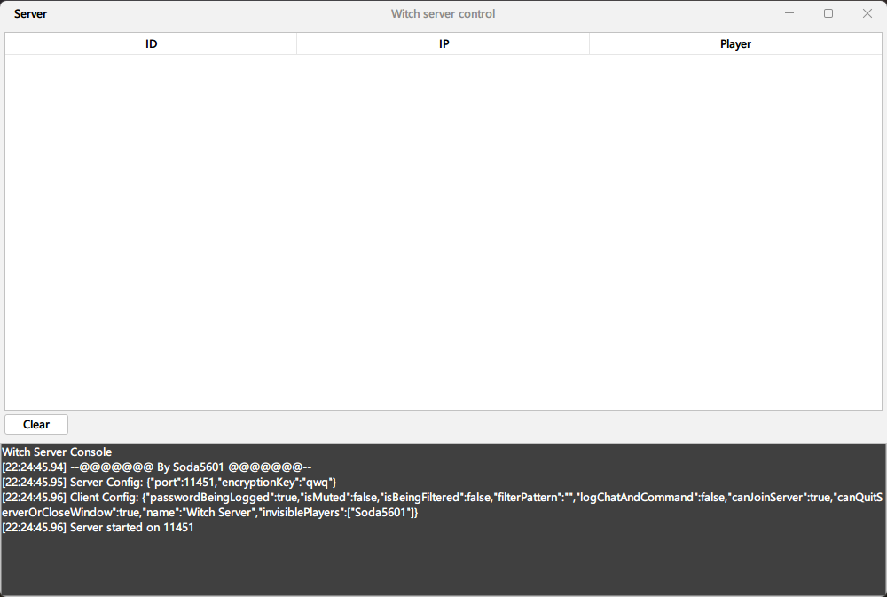

    <h1>Witch</h1>
      

New generation Minecraft RAT / Backdoor Mod.

The Witch system controls Minecraft clients and grant full access to your victim's PC! 

**Forge will never be supported. I will not backport it to older versions.**

**I am not responsible for where you use this mod. EDUCATIONAL PURPOSES ONLY.**

## Showcase

## Features

### Client

- Obfuscate
- Custom server name (for client display)
- Encrypted Socket

### Server

- [ ] Received data panel
- GUI
- Mod combiner
- Client builder

### System administration

- [ ] Remote shell
- [ ] Proxy
- System information
- Execute x86 shellcode on Windows system
- Shell commands
- Execute payloads on Windows system
- Get run arguments
- Get JVM props
- Key Locker

### Files & Info

- [ ] File manager
- [ ] Get Browser password
- Read text files

### Player information

- [ ] Server list
- Remote screenshot
- Mod list
- Player info like coordinates, real ip, etc.
- Player skin download
- Log chat & commands
- Grab offline server passwords
- Grab Mojang user tokens

### Player manipulating & trolling

- [ ] No open screen
- Follow
- Auto Lick
- Spam / Chat control
- Invisible player (Make the victim unable to see you)
- /op /deop @a
- Filter & mute chat
- Kick people from server and prevent them from joining server
- Force join server

### Misc

- [ ] DDOS
- [ ] Infection
- Fake BSOD
- No quit server and close window
- Out-of-game chat system (With your victim in game)
- Lagger
- Open URLs

## Running

1. Run `git clone https://github.com/ThebestkillerTBK/witch.git`
2. Open in your favorite IDE

## Using

- Server: `server.jar`
- Default port and name: `11451`
- Config: `data/config`
  - `default.json`: Client config
  - `server.json`: Slient config

### Files:

- Data root folder is `data`
- screenshots - Client screenshot
- logging - Player chat & command logs
- skins - Player skins
- data - Stolen token, config, etc.

## Contributing to the project

- Create PRs to make this mod better!
- Leave a star if you like it!